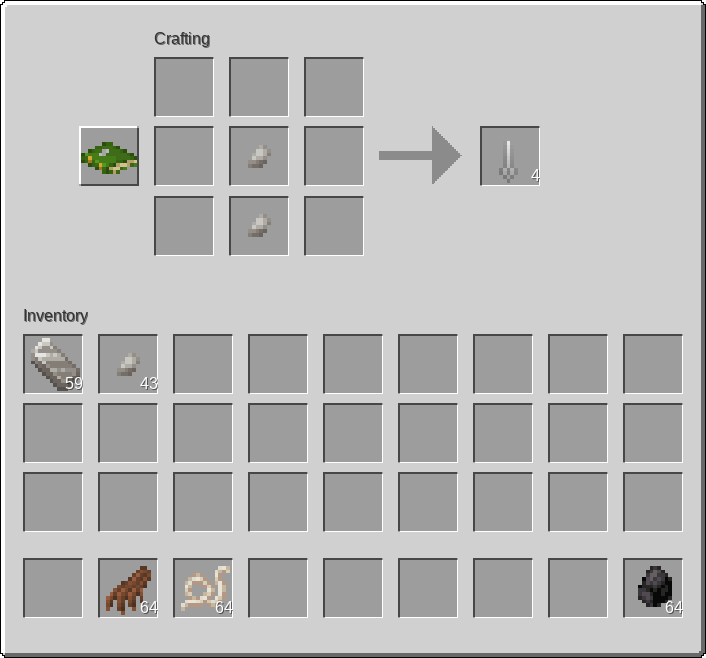
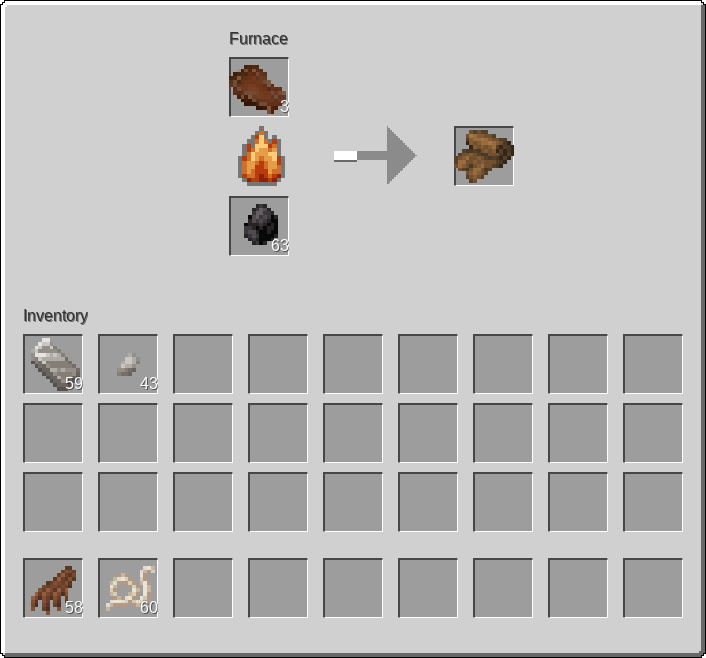

# Rotten Flesh to Leather Mod for MineClone 2

This is a mod for MineClone 2 to be able to craft leather. You need to craft a needle by 2 iron nugget.

After that you need 2 rotten flesh and 1 string to craft sewed flesh. 

Finally you can cook that sewed flesh to get leather.

